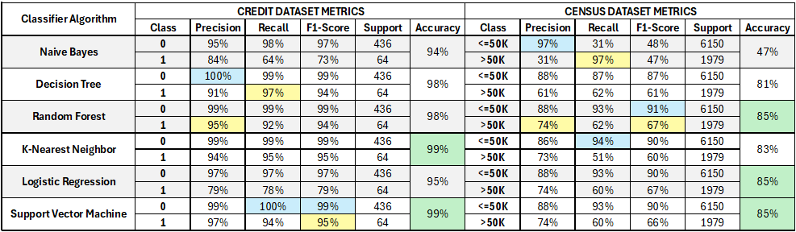

## The Main Goal

In this project, the idea is to work with two datasets:

- *credit.csv*: Contains credit information of clients from a specific bank.
- *census.csv*: Contains census information.

From the *credit* dataset, the goal is to classify/predict if a client is going to pay their debts correctly (*0=NO DEBT or 1=IN DEBT*) based on the following features:

|  Income  |  Age  |  Loan  |  Default (TARGET)  |
|:--------:|:-----:|:------:|:------------------:|
|   ...    |  ...  |   ...  |        ...         |

From the *census* dataset, the goal is to classify/predict a person's yearly **income** (*<=50K or >50K*) based on the following features:

|  Age  |  Workclass  |  Final-weight  |  Education  |  Education-num  |  Marital-status  |  Occupation  |  Relationship  |  Race  |  Sex  |  Capital-gain  |  Capital-loss  |  Hours-per-week  |  Native-country  |  Income (TARGET)  |
|:-----:|:-----------:|:--------------:|:-----------:|:---------------:|:----------------:|:------------:|:--------------:|:------:|:-----:|:--------------:|:--------------:|:----------------:|:----------------:|:-----------------:|
|  ...  |     ...     |      ...       |     ...     |       ...       |        ...       |      ...     |       ...      |   ...  |  ...  |       ...      |       ...      |        ...       |        ...       |        ...        |

## A Brief Overview of the ML Algorithms Used in This Project and Their Need for Scaling and Encoding

### 1. Naive Bayes
Naive Bayes is a probabilistic classifier based on Bayes' Theorem, assuming conditional independence between features.
- **Scaling**: Not required.
- **Encoding**: One Hot Encoder or Label Encoder.

### 2. Decision Tree
Decision Tree is a supervised learning model that splits the data into homogeneous segments, creating a decision tree based on features.
- **Scaling**: Not required.
- **Encoding**: Label Encoder or One Hot Encoder.

### 3. Random Forest
Random Forest is an ensemble of multiple decision trees trained with different subsets of data and features, improving accuracy and reducing overfitting.
- **Scaling**: Not required.
- **Encoding**: Label Encoder or One Hot Encoder.

### 4. K-Nearest Neighbors (KNN)
KNN is a classification algorithm that assigns a class to a data point based on the classes of the K nearest neighbors.
- **Scaling**: Required.
- **Encoding**: One Hot Encoder.

### 5. Logistic Regression
Logistic Regression is a classification algorithm that models the probability of a binary outcome based on a logistic function.
- **Scaling**: Required.
- **Encoding**: One Hot Encoder.

### 6. Support Vector Machine (SVM)
SVM is an algorithm that finds an optimal hyperplane to separate classes by maximizing the margin between data points of different classes.
- **Scaling**: Required.
- **Encoding**: One Hot Encoder.

### Summary
- **Algorithms requiring scaling**: KNN, Logistic Regression, SVM.
- **Algorithms preferring One Hot Encoding**: Naive Bayes, KNN, Logistic Regression, SVM.
- **Algorithms that can use either Label Encoder or One Hot Encoder**: Naive Bayes, Decision Tree, Random Forest.

### Conclusion
For KNN, Logistic Regression and SVM, the use of **scaling** and **One Hot Encoding** is highly recommended. For the other algorithms, scaling is not necessary, and you can choose between Label Encoding and One Hot Encoding depending on the nature of your categorical variables.

---

## Metrics results of each Algorithm used for the 2 different datasets:

  

